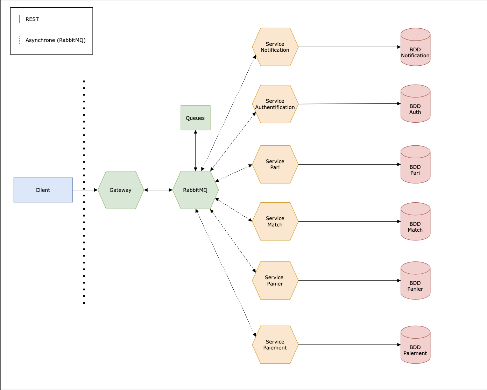
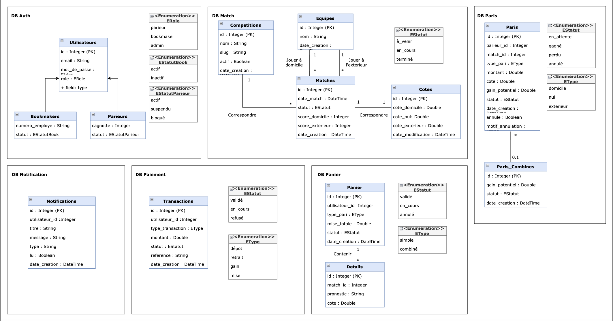

# TheRealDeal - Projet API M2 MIAGE 2024/2025

## Auteurs
- FAZZARI Thomas
- CHARTIER Guillaume
- COLOMBANA Ugo

## À propos
Plateforme de paris sportifs construite avec une architecture microservices.

## Analyse du Domaine

### Core Domain : Paris Sportifs
Le domaine métier de la plateforme est la gestion de paris sportifs. Cela englobe l'ensemble du processus de paris, depuis leur création jusqu'à leur fin. Les paris peuvent être simples et combinés. Il est aussi nécéssaire de gérer le calcul des cotes et des gains, la validation des contraintes (délais, limites, cagnotte suffisante) et la distribution automatique des gains/pertes aux parieurs.

### Supporting Domains

**Gestion Utilisateurs** : 
Domaine relatif à la gestion de l'authentification et les autorisations des utilisateurs. Il couvre la maintenance des profils des parieurs et bookmakers, avec leurs rôles et permissions spécifiques.

**Gestion Événements** : 
Domaine relatif à la gestion du catalogue des événements sportifs sur lesquels les paris sont proposés. Il couvre la gestion des compétitions et des équipes, le suivi des matchs et leurs résultats, ainsi que la mise à jour dynamique des cotes.

**Gestion Financière** : 
Domaine relatif à la gestion des transactions financières : dépôts et retraits des parieurs, distribution des gains/pertes, remboursements en cas d'annulation. Il doit aussi maintenir une historique complet des mouvements financiers.

### Generic Domain : Notifications
Domaine générique qui couvre la communication avec les utilisateurs via email et SMS. Il informe les parieurs des résultats de leurs paris, de leurs gains éventuels etc.


## Architecture
### Schémas




## Technologies utilisées

### Backend
- Python 3.11 avec Flask
- SQLAlchemy pour l'ORM
- Pika pour RabbitMQ
- PyJWT pour l'authentification
- RabbitMQ comme Message Broker

### Bases de données
- PostgreSQL
- Volumes persistants Docker
- Une base dédiée par service

### Conteneurisation
- Docker avec Docker Compose

### Sécurité
- Tokens JWT pour l'authentification des utilisateurs
- Utilisation de variables d'environnement
- Système de rôles (parieur, bookmaker)

  
### Services

#### Gateway
- Point d'entrée
- Routage des requêtes entre les microservices
- Authentification et validation des tokens JWT
- Gestion des timeouts et retries

#### Authentication
- Gestion des comptes utilisateurs
- Gestion des rôles (parieur, bookmaker)
- Authentification (via tokens JWT) et inscription
  
#### Match 
- Gestion des données sportives
- CRUD compétitions et équipes
- Gestion des matchs et des côtes
- Publication des résultats

#### Pari
- Gestion des paris simples et combinés
- Vérification des contraintes (délais, limites, cagnotte suffisante)
- Calcul et distribution des gains

#### Panier
- Gestion des paris multiples
- Vérification des contraintes (délais, limites, cagnotte suffisante)

#### Paiement  
- Gestion des dépôts et retraits
- Distribution des gains, remboursements, annulations
- Historisation des transactions
- Vérification des soldes

#### Notification (pas implémenté)
- Envoi des notifications via e-mail et SMS (gains, scores en direct, ...)


## Pattern des services

Chaque microservice suit une architecture standardisée :

```bash
└── service_<nom>
    ├── Dockerfile        # Configuration du conteneur
    ├── app.py            # Routes
    ├── models.py         # Modèles de données
    ├── repository.py     # Traitements des données
    ├── requirements.txt  # Liste des dépendances Python
    └── utils
        └── rabbitmq.py   # Utilitaires RabbitMQ
```

### Communication

#### Communication Synchrone (via REST)
Utilisée pour les requêtes nécessitant une réponse immédiate, par exemple :
- Authentification/Autorisation
- Consultation des matchs et cotes
- Placement des paris
- Vérifications de solde
- Transactions financières

#### Communication Asynchrone (via RabbitMQ)
Gérée via des queues pour les événements :

**match_resultats**
- Publication des résultats de matchs
- Déclenchement des calculs de gains

**user_updates**
- Mouvements financiers (dépôts/retraits)
- Mise à jour des cagnottes

**pari_updates**
- Création et validation de paris
- Distribution des gains

**panier_updates**
- Création et validation des paniers

#### Tests API

La collection Postman est disponible dans le fichier [TRD-Postman.json](./TRD-Postman.json). Elle contient les tests pour tous les services implémentés, vérifiant les codes de retour, les formats de réponse et les cas d'erreur.
